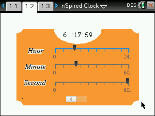

# nSpired-Clock
A small "clock" that can be run on a Ti-Nspire calculator.

The thing can be emulated via the [Firebird Emulator](https://github.com/nspire-emus/firebird), but you'll to dump a bunch of firmware files which I cannot provide for obvious reasons.

### Screenshots

